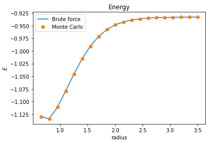
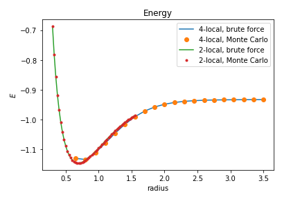

## Project 4: Ising Annealing

Your final week's project will guide you through the process of mapping an electronic structure Hamiltonian to a classical Ising model, and then solving for the groundstate of the model using a thermal anneling Monte Carlo simulation.

A very brief introduction to the main ideas behind the project, and the basics of the Monte Carlo method are
[here.](https://github.com/CDL-Quantum/CohortProject_2020/blob/master/CDL_2020_docs.pdf)

In our [Project4_LandingPage.pdf](https://github.com/CDL-Quantum/CohortProject_2020/blob/master/Project_4_Ising_Annealer/Project4_LandingPage.pdf),
we provide more technical information the Ising Hamiltonians involved.
Click on this link to begin learning about your tasks for this week!

## Tasks include:

- Perform thermal annealing to solve for the groundstate of a ferromagnetic Ising model.
- Perform thermal annealing to solve for the groundstate of disordered Ising models.
- Apply what you have learned to solve the Hydrogen molecule groundstate.

## Further Challenges:

- Explore the annealing procedure on the Mattis glass.

          **We have explored this challenge, please consult the results section**

- Devise a 2-local Ising Hamiltonian for the Hydrogen molecule, and compare your results.

          **We have created a 2-Local Ising Hamiltonian, please consult the results section**
          
- Solve your 2-local Hamiltonian (or any Hamiltonian) on open-source commercial software, and compare the performance.

          **We have included a DWave Anneal for the H2 Molecule implementing a 2-Local Ising Hamiltonian, please see the results section**
          
- Go wild and try thermal annealing on your favorite NP-hard problem!

          **We have attempted to implement a demonstration solver for a routing problem using 4 nodes. Please see the results section**

## Business Application

One again, your team is asked to complete a Business Application. Questions you will be asked are:

- Explain to a layperson the technical problem you solved in this exercise.
- Explain or provide examples of the types of real-world problems this solution can solve.
- Identify at least one potential customer for this solution - ie: a business who has this problem and would consider paying to have this problem solved.
- Prepare a 90 second video explaining the value proposition of your innovation to this potential customer in non-technical language.

For more details refer to the [Business Application found here](./Business_Application.md)

## Presenting your results in your pull request

For your pull request, consider the following for the presentation of your final results:

- Work entirely in the directory for Project 4.
- Edit this README.md file with a highlight of your main technical results. Provide links to any other files with your detailed results, e.g. Jupyter notebooks.
- For your Business Application, feel free to provide your answers directly in the
  [Business_Application.md](./Business_Application.md) file.
- Do not directly upload your video file (or any other large files) to the repository. Instead, provide a link e.g. to a YouTube video, or a Google Drive file.
- Include a file contributions.md that lists the contributions of each group member.

## Results

### Annealing schedules in MC simulations

We experimented with a few types of anealing procedures.

- **Static annealing schedules**

  - Exponential decay was the most useful.
  - We also tried to mix in a cyclic modulation of the form $e^{A\sin(t/P)}$. It didn't hurt, but it didn't obviously help.
  - Linear decay seemed quite useless as most of the MC simulations were spent in a high energy regime with a sharp transition to low energy at some point. It seems that the behaviour of MC wrt temperature is exponential in nature.

- **Dynamic annealing procedures**
  - _Reduce T on plateau_. When the energy stops improving, reduce T. This is motivated by the idea of letting MC take the time it needs to search at each temperature level.
  - _Increase T at local minimum_. When the energy stops improving (even with decreasing T), jump the T up to a higher value to give MC a chance at exploring neighboring local minima.
  - _Gradient based approach_. This is an attempt to combine the above and produce a more continuous repsonse. We look at the historical gradient of the energies and change T based on that. If the gradient is 0 we have a default level of exponential decay. For more positive gradients we increase the decay strength. For more negative gradients we decrease the decay strenght, or even switch to growing T.

Overall we found that none of our fancier methods could really outperform vanilla exponential decay (but they didn't do worse).

**Challenge 1**. For the Mattis model we found that exponential decay works across all suggested system sizes (and even larger ones), and we don't even need to tweak hyperparameters.

### Hydrogen molecule

In [Task_3](./Task_3.ipynb) our class `GeneralizedIsingModel` allows preparation of an arbitray model, not just limited to 4-locality.

We find that an exponential annealing schedule is good enough to find the exact solution for all bond lengths.

We also try a 2-local version of the same problem and find reasonable agreement with the 4-local version:

